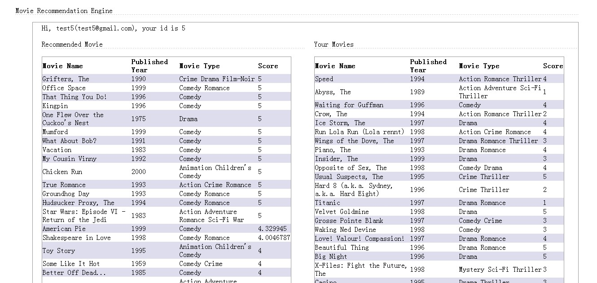

### Mahout入门实例-基于 Apache Mahout 构建社会化推荐引擎-实战（参考IBM）

在tomcat的server.xml中</Host>前添加以下内容

```
<Context path="MovieSite" docBase="D:\developer\eclipsework\MovieSite\movie" reloadable="true" >
    <Resource name="jdbc/movie"
		auth="Container"
		type="javax.sql.DataSource"
		factory="org.apache.tomcat.jdbc.pool.DataSourceFactory"
		testWhileIdle="true"
		testOnBorrow="true"
		testOnReturn="false"
		validationQuery="SELECT 1"
		validationInterval="30000"
		timeBetweenEvictionRunsMillis="30000"
		maxActive="100"
		minIdle="10"
		maxWait="10000"
		initialSize="10"
		removeAbandonedTimeout="60"
		removeAbandoned="true"
		logAbandoned="true"
		minEvictableIdleTimeMillis="30000"
		jmxEnabled="true"
		jdbcInterceptors="org.apache.tomcat.jdbc.pool.interceptor.ConnectionState;
		org.apache.tomcat.jdbc.pool.interceptor.StatementFinalizer"
		username="root"
		password=""
		driverClassName="com.mysql.jdbc.Driver"
		url="jdbc:mysql://localhost:3306/movie"/>
</Context>
```



### 参考链接

* [http://www.ibm.com/developerworks/cn/java/j-lo-mahout/](http://www.ibm.com/developerworks/cn/java/j-lo-mahout/)
* [http://www.cnblogs.com/abc123456789/p/3504853.html](http://www.cnblogs.com/abc123456789/p/3504853.html)
